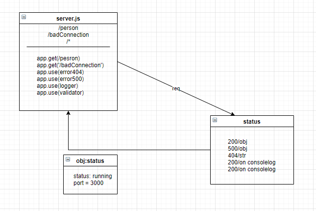

# basic-express-server
LAB - 02
Deployment Test
* Author: Maram Abu Murad
* [tests report](https://github.com/Maram-997/basic-express-server/actions)
* [Heroku link](https://basic-expresserver.herokuapp.com/person)
* Setup
.env requirements
PORT - 3000
* Running the app
npm index.js
1. Endpoint: /person
Returns object
{
"name": "maram"
}

3. Endpoint : '*'
returns ERROR 
'Page NOT FOUND.'
4. Endpoint : /badConnection
Returns Object 
{
"error": 500,
"path": "/badConnection",
"message": "Something WENT WRONG Internal Server Error"
}

* Tests
 npm test

* UML Diagram
